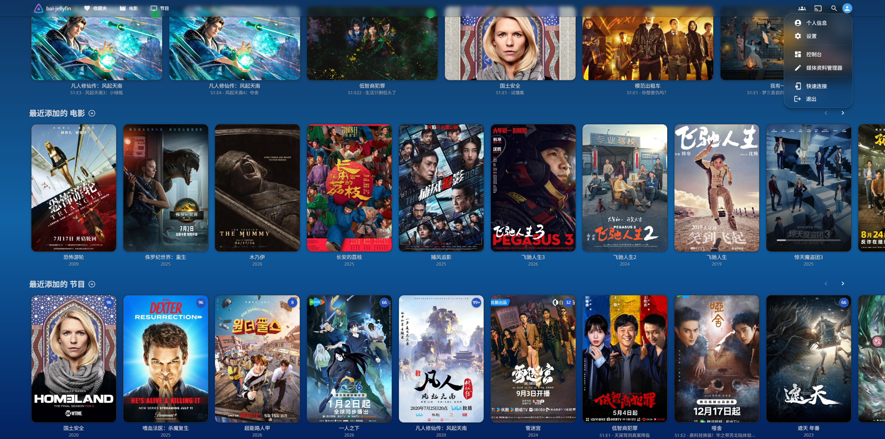
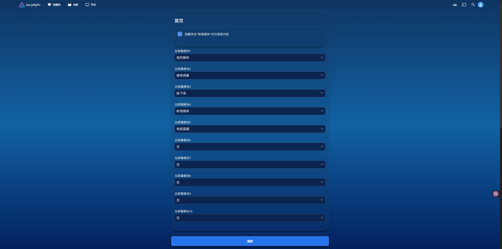
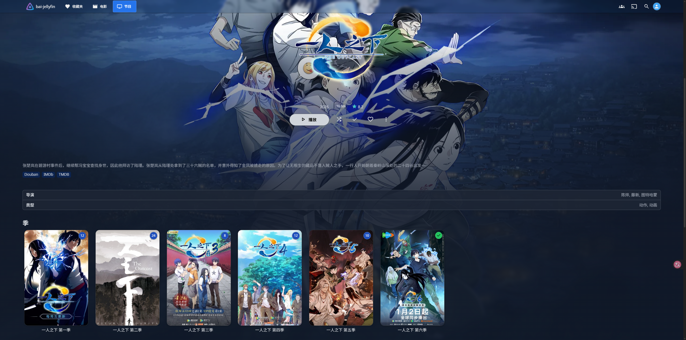

# Bai-JellyfinTheme

A customized Jellyfin theme based on [ElegantFin](https://github.com/lscambo13/ElegantFin) by lscambo13.

This project contains visual modifications and customizations made by CG-Bai.

## Preview

### Home



### Settings



### Library


### Series Details - Episodes


### Series Details - Seasons



## Installation

Open Jellyfin:

**Dashboard → General → Custom CSS code**

Paste:

```css
@import url("https://cdn.jsdelivr.net/gh/CG-Bai/Bai-JellyfinTheme@main/Theme/Bai-JellyfinTheme.css");
```

Save the settings and refresh Jellyfin.

### Fixed Version

The `main` branch always points to the latest version.

If you prefer to use a fixed release version, you can replace `@main` with a release tag.

Example:

```css
@import url("https://cdn.jsdelivr.net/gh/CG-Bai/Bai-JellyfinTheme@v1.0.0/Theme/Bai-JellyfinTheme.css");
```

## Disclaimer

Most of the CSS code in this theme was generated or modified with the help of AI.

I do not have any coding experience, so if something breaks, please don't ask me how to fix it. 😄

> 本主题的大部分 CSS 代码由 AI 生成或协助修改。  
> 本人基本不懂代码，所以如果出现问题，我可能无法提供技术支持。

## Credits

Bai-JellyfinTheme is based on:

- Original project: [ElegantFin](https://github.com/lscambo13/ElegantFin)
- Original author: lscambo13
- Modified by: CG-Bai

Special thanks to lscambo13 for creating ElegantFin and making it available as open-source software.

## License

This project is distributed under the GNU General Public License v2.0.

See the [LICENSE](LICENSE) file for details.
